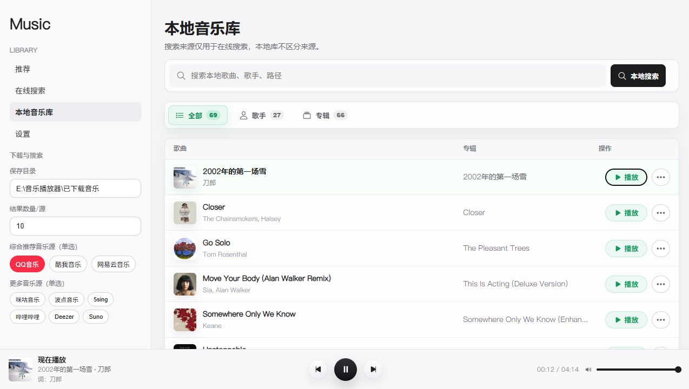

# Music Player

<p align="center">
  一款面向 Windows 的本地桌面音乐播放器，集在线搜索、下载、本地曲库、歌词和音效于一体。
</p>

<p align="center">
  <a href="https://github.com/Code-dogcreatior/Music-Player/releases/latest">下载最新版</a>
  ·
  <a href="#快速开始">快速开始</a>
  ·
  <a href="#本地开发">参与开发</a>
</p>



## 功能亮点

- 多音乐源在线搜索，搜索结果按来源完成进度增量展示。
- 本地音乐库按歌曲、歌手和专辑浏览，支持目录扫描和播放历史统计。
- 桌面底部播放栏与全屏歌词播放器，支持歌词翻译和时间轴调整。
- 10 段 EQ、响度归一化近似、限制保护、音量增强和简单空间感。
- 基于本地曲库与播放历史生成推荐，在线服务不可用时自动回退到本地推荐。
- Windows 桌面打包、GitHub Release 发布和应用内检查更新。
- 更新只替换程序文件，保留已下载歌曲、SQLite 曲库和播放历史。

## 快速开始

### 普通用户

1. 打开 [Releases](https://github.com/Code-dogcreatior/Music-Player/releases/latest)。
2. 下载 `music-player-windows-x64.zip` 和对应的 `.sha256` 文件。
3. 解压 ZIP，不要直接在压缩包里运行。
4. 双击 `music-server.exe`。

程序窗口关闭后，内置后端会一并退出，不会继续占用后台端口。

> 仓库为 Private 时，只有拥有仓库权限的 GitHub 用户可以查看和下载 Release；面向所有用户分发时，需要公开仓库或使用独立的公开二进制发布仓库。

### 从源码启动

需要 Python 3.10、Node.js 24 和 npm。

```powershell
git clone https://github.com/Code-dogcreatior/Music-Player.git
cd Music-Player

python -m pip install -r backend/requirements.txt
cd frontend
npm ci
cd ..

# 终端 1
python -m uvicorn backend.app:app --host 127.0.0.1 --port 8000

# 终端 2
cd frontend
npm run dev
```

开发页面默认位于 `http://127.0.0.1:5173/`。

## 自动更新与数据保留

- Windows 打包版启动约 3.5 秒后检查 GitHub 最新 Release，也可在“设置”页手动检查。
- 下载过程采用流式写盘，并校验 GitHub Release 提供的 SHA-256 摘要。
- 安装更新时只替换 `music-server.exe` 和 `_internal`。
- `已下载音乐`、`music_player.sqlite3`、WAL/SHM 文件不会被覆盖或移动。
- 新版本启动失败时，更新器会尝试回滚旧程序并重新启动。
- 重新执行本地打包也会临时保管并恢复打包目录中的歌曲和数据库。

建议把下载目录设置在程序目录之外，以便迁移、备份和多版本共用。

## 音乐源与综合排序

当前默认综合顺序：

1. QQ 音乐
2. 酷我音乐
3. 网易云音乐
4. 咪咕音乐
5. 波点音乐
6. 5sing
7. 哔哩哔哩
8. Deezer
9. Suno

综合排序权重为：曲库体量/命中率 50%、可播放成功率 30%、响应速度 20%。

2026-08-07 基线测试使用 Python 3.10.9、`musicdl 2.13.4`，关键词为“周杰伦”。外部接口会受到网络、限流和解析服务状态影响，数据只代表当时版本。

| 综合顺序 | 音乐源 | 当时耗时 | 返回/请求 | 可播放 |
| ---: | --- | ---: | ---: | ---: |
| 1 | QQ 音乐 | 3.03 秒 | 5/5 | 5/5 |
| 2 | 酷我音乐 | 8.29 秒 | 5/5 | 5/5 |
| 3 | 网易云音乐 | 2.07 秒 | 1/3 | 1/1 |
| 4 | 咪咕音乐 | 1.26 秒 | 3/3 | 3/3 |
| 5 | 波点音乐 | 0.41 秒 | 3/3 | 3/3 |
| 6 | 5sing | 0.64 秒 | 3/3 | 3/3 |
| 7 | 哔哩哔哩 | 1.14 秒 | 3/3 | 3/3 |
| 8 | Deezer | 7.88 秒 | 1/3 | 1/1 |
| 9 | Suno | 3.99 秒 | 3/3 | 3/3 |

Apple Music 默认隐藏，因为完整接入需要 Apple Developer Program、Apple Music 订阅和用户授权。相关说明见 [APPLE_MUSIC_CONFIG.md](APPLE_MUSIC_CONFIG.md)。

## 可选服务配置

基础播放、搜索和本地曲库不要求翻译服务 Key。歌词翻译和 ListenBrainz 推荐属于可选能力，配置项示例见 [.env.example](.env.example)。

后端会自动读取项目根目录的 `.env`；打包版读取 `music-server.exe` 同目录的 `.env`。系统环境变量优先级更高，也可以通过 `MUSIC_PLAYER_ENV_FILE` 指向程序目录之外的配置文件。

先复制示例并填入你自己新建的 Key：

```powershell
Copy-Item .env.example .env
```

`.env` 已被 Git 忽略，不会进入提交。也可以只在 PowerShell 当前会话中配置：

```powershell
$env:ALI_TRANSLATE_API_KEY = "你的阿里百炼 Key"
$env:DEEPSEEK_API_KEY = "你的 DeepSeek Key"
python -m uvicorn backend.app:app --host 127.0.0.1 --port 8000
```

请勿把真实 API Key、Token、Cookie 或账号信息提交到 Git。

## 本地开发

### 前端

```powershell
cd frontend
npm ci
npm run lint
npm run build
```

前端技术栈：React 19、TypeScript、Vite。

### 后端

```powershell
python -m unittest discover -s backend -p "test_*.py"
```

后端技术栈：FastAPI、Uvicorn、MusicDL、SQLite、PySide6、PyInstaller。

### Windows 打包

```powershell
python build.py --clean
```

产物位于 `dist/music-server/`。构建前请确认所使用的 Python 环境已经安装 `backend/requirements.txt` 中的依赖。

## 发布新版本

应用版本统一维护在 [backend/app_version.py](backend/app_version.py)。提交版本修改后，推送与版本完全一致的标签：

```powershell
git tag v0.1.1
git push origin v0.1.1
```

`.github/workflows/release.yml` 会在 Windows Runner 上执行测试、前端构建、PyInstaller 打包，并上传 ZIP 和 SHA-256 到 GitHub Release。标签与 `APP_VERSION` 不一致时发布会失败。

## 项目结构

```text
backend/                 FastAPI、桌面壳、音乐服务、数据库与更新器
frontend/                React/Vite 用户界面
docs/images/             README 与文档截图
.github/workflows/       Windows Release 自动构建
build.py                 本地一键打包入口
```

## TODO

- 继续监控 QQ 音乐搜索耗时、限流和失效情况，避免慢解析拖延前端展示。
- 持续验证酷我等来源的播放成功率和外部接口稳定性。
- 继续拆分音频元素控制、播放队列、歌词调度和全屏播放器状态。
- 增强本地曲库的歌手、专辑、目录、最近播放和下载时间筛选。
- 整理歌词、翻译、音效链路和调试开关的设置分组。

## 使用说明

本项目不包含或分发音乐文件。在线搜索、试听和下载能力依赖第三方服务，其可用性和内容授权不由本项目保证。请遵守所在地法律法规、音乐平台服务条款和版权要求，仅处理你有权使用的内容。

当前仓库尚未附带开源许可证；源码的复制、修改和再分发范围以仓库后续许可证声明为准。
